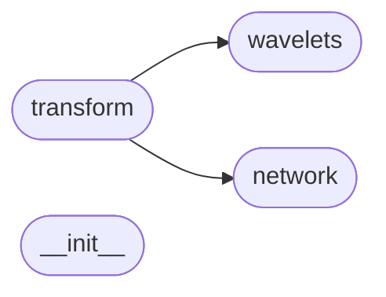

# Code Overview

[_Documentation generated by Documatic_](https://www.documatic.com)

<!---Documatic-section-Codebase Structure Python-start--->
## Codebase Structure Python

The codebase has a flat structure, with 4 code files.

<!---Documatic-block-system_architecture-start--->

<!---Documatic-block-system_architecture-end--->

# #
<!---Documatic-section-Codebase Structure Python-end--->

<!---Documatic-section-Class Hierarchy-start--->
## Class Hierarchy

<!---Documatic-block-nn.Module-start--->

	
<code>nn.Module</code> (Click to Expand!)

* wavelets_pytorch.network.TorchFilterBank

<!---Documatic-block-nn.Module-end--->

<!---Documatic-block-object-start--->

	
<code>object</code> (Click to Expand!)

* wavelets_pytorch.transform.WaveletTransformBase
* wavelets_pytorch.wavelets.DOG
* wavelets_pytorch.wavelets.Morlet
* wavelets_pytorch.wavelets.Paul

<!---Documatic-block-object-end--->

<!---Documatic-block-wavelets_pytorch.transform.WaveletTransformBase-start--->

	
<code>wavelets_pytorch.transform.WaveletTransformBase</code> (Click to Expand!)

* wavelets_pytorch.transform.WaveletTransform
* wavelets_pytorch.transform.WaveletTransformTorch

<!---Documatic-block-wavelets_pytorch.transform.WaveletTransformBase-end--->

<!---Documatic-block-wavelets_pytorch.wavelets.DOG-start--->

	
<code>wavelets_pytorch.wavelets.DOG</code> (Click to Expand!)

* wavelets_pytorch.wavelets.Ricker

<!---Documatic-block-wavelets_pytorch.wavelets.DOG-end--->

# #
<!---Documatic-section-Class Hierarchy-end--->

[_Documentation generated by Documatic_](https://www.documatic.com)